# Les Innovations Portal

Les Innovations service portal. Custom, freelance and on-demand software development agency.

### Convertimos visiones en éxitos mediante software innovador y a medida.

Estamos comprometidos con la innovación y la creación de productos tecnológicos disruptivos que transforman la visión de nuestros clientes en realidad.

- Portafolio diverso que demuestra nuestra experiencia en distintos sectores.
- Nos ajustamos a tu presupuesto sin sacrificar la calidad.
- Nuestra reputación y testimonios de clientes respaldan la confianza que hemos construido

En nuestra empresa, con más de 10 años de experiencia, el enfoque se basa en comprender los desafíos únicos de cada industria para desarrollar software que no solo resuelva problemas actuales, sino que también posicione a nuestros clientes para el éxito futuro.

## Pilares

¿Por qué elegirnos?

#### Soluciones a medida

Reconocemos que cada empresa es distinta. Nuestro equipo se dedica a comprender tus necesidades y metas específicas, y crea una solución de software que se alinea perfectamente con tu modelo de negocio.

#### Tecnología de vanguardia

Nos mantenemos al día con las últimas tendencias y tecnologías en el mundo del desarrollo de software. Te proporcionamos soluciones basadas en tecnología de punta para asegurarnos de que estés un paso adelante de la competencia.

#### Optimización de costos

Creamos soluciones que se alinean con tu presupuesto sin sacrificar la calidad. Con software personalizado, solo pagas por las funcionalidades que realmente necesitas.

#### Seguridad robusta

La seguridad es nuestra prioridad número uno. Implementamos rigurosas medidas de protección en nuestras soluciones de software para garantizar la máxima seguridad de tu negocio y la protección integral de tus datos.

## Servicios

Nuestros Servicios

#### Software a Medida

Creamos plataformas web, de escritorio, modernización de sistemas existentes, Landign Page para tu funnel de marketing.

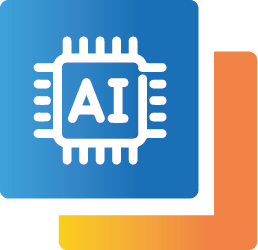

#### Inteligencia Artificial & ML

Potenciamos tu solución con los modelos de Inteligencia Artificial mejores entrenados, elevando competitividad y eficiencia.

#### App Móviles Android & iOS

Desarrollamos aplicaciones móviles con diseño UX/UI/IxD que se adaptan a las últimas tendencias y tecnologías emergentes.

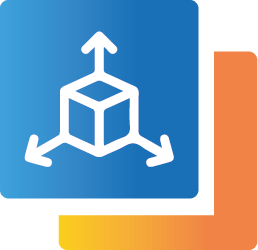

#### VR, AR, MR, y videojuegos

Gamificación en modelos de negocios. Soluciones avanzadas basadas en Unity3D. Fortalecemos iniciativas comerciales con Ralidad Aumentada y Mini Games.

#### Inteligencia de Negocio

Hacemos que veas el futuro y te adelantes a él. Creamos el panel de mando de tu negocio para el análisis estadístico, basado en tus procesos.

#### Consultoria y Análisis

Te ayudamos a identificar oportunidades y optimizar estrategias. Proporcionamos recomendaciones prácticas para despegar rápido y eficientemente.

## Portafolio

Nuestro Portafolio

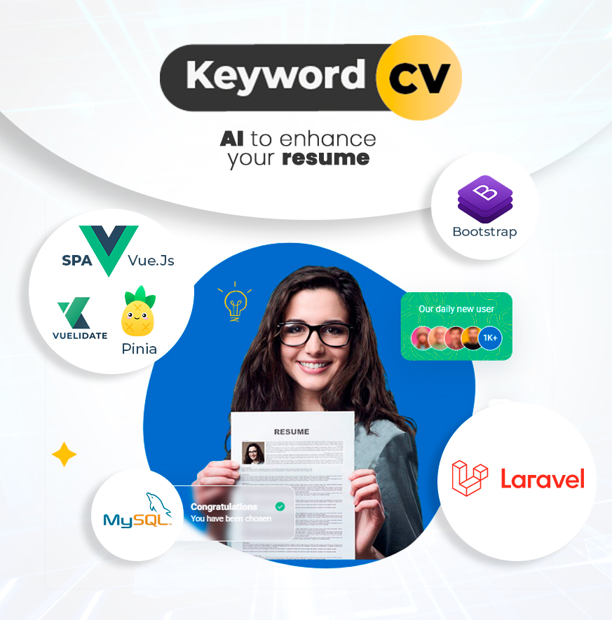

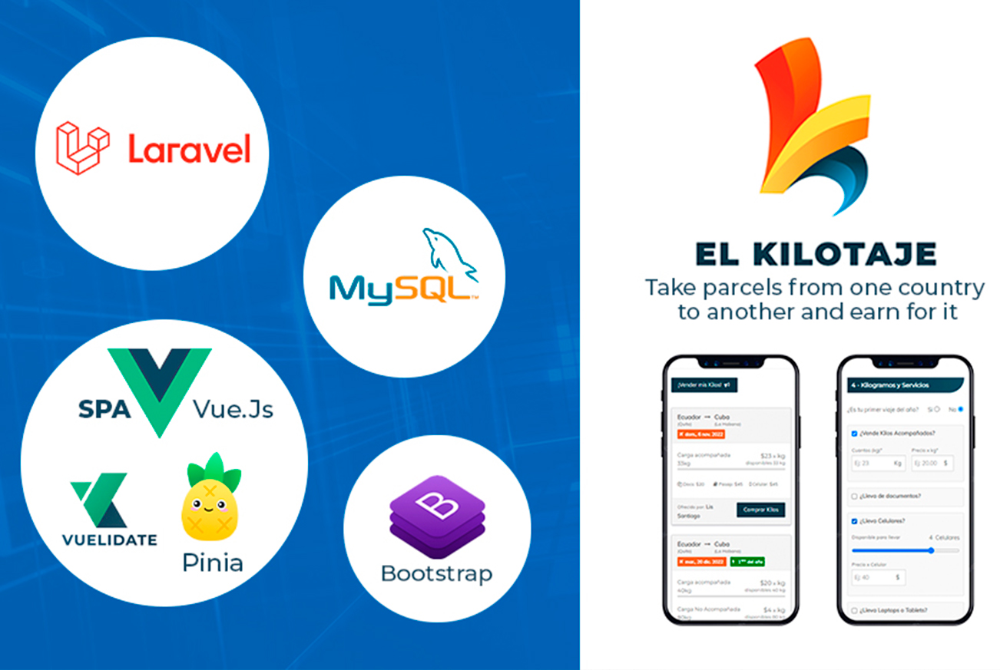

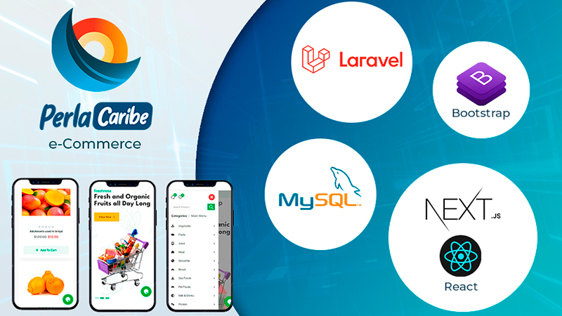

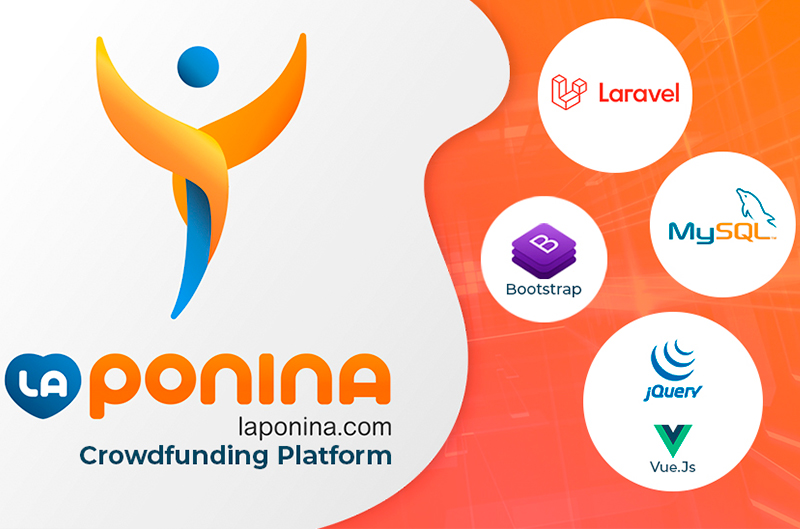

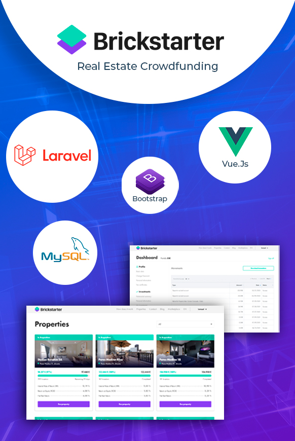

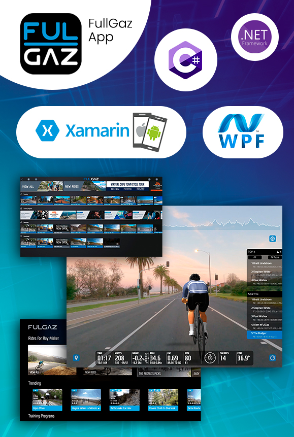

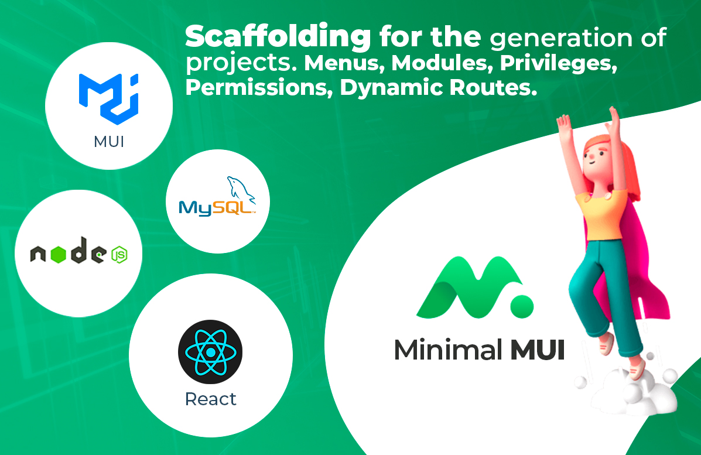

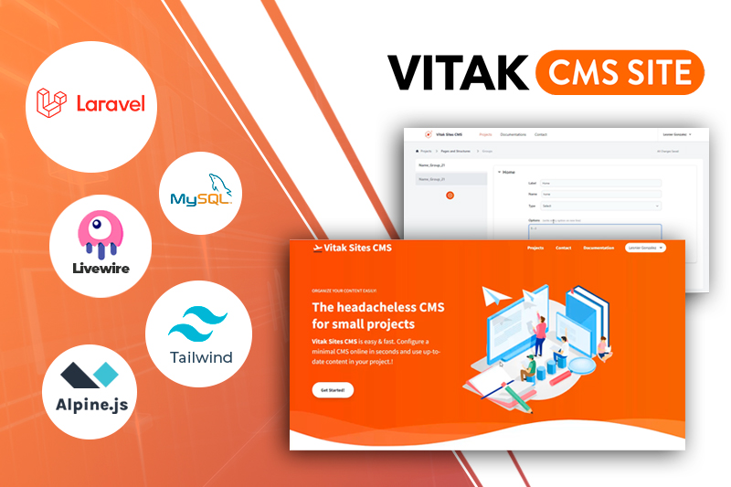

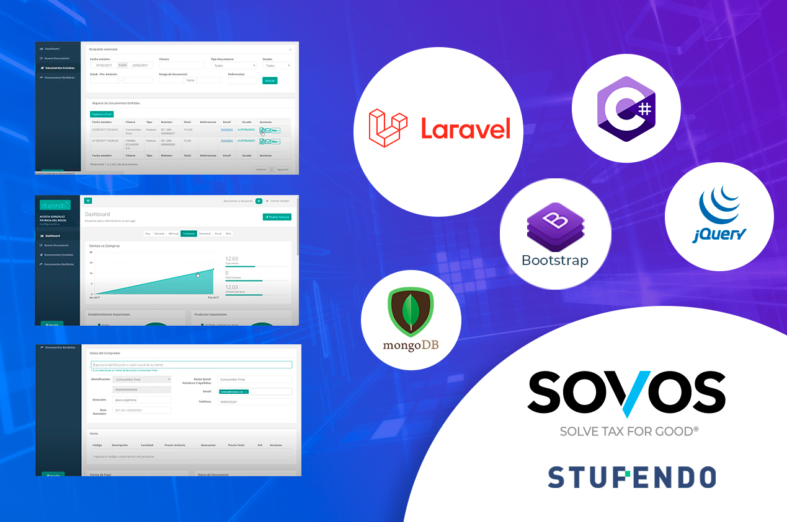

### ¿Cuáles son los riesgos de elegir la empresa equivocada?

Descubra los desafíos que enfrentan los empresarios como usted cuando se conforman con menos.

Vulnerabilidades

**Sin prácticas de seguridad adecuadas**, el software puede ser vulnerable a ataques cibernéticos, lo que podría resultar en la pérdida de datos, problemas de privacidad y daños a la reputación de la empresa..

Incumplimientos

**Sin procesos estandarizados** puede tener problemas para cumplir con los plazos acordados, lo que puede retrasar el lanzamiento del producto y afectar tus planes de negocio.

Costos Extras

**Sin estándares adecuados** tendrás que realizar múltiples correcciones y ajustes post-desarrollo, lo que incrementa el costo total del proyecto. Con riesgo de ser necesario rehacer o realizar modificaciones costosas en el futuro.

Desprestigio

**Sin estándares de calidad** puede entregar un software con muchos errores, problemas de rendimiento, y fallos de seguridad. Esto puede afectar negativamente la experiencia del usuario y la reputación de la empresa.

## Tecnologías

Tecnologías que usamos

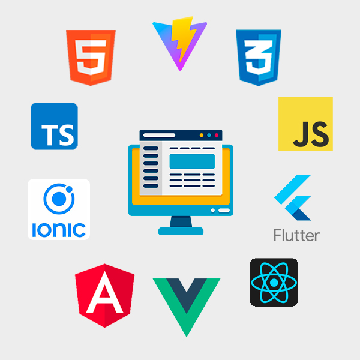

#### Front End

Incluyen HTML, CSS y JavaScript, que son los pilares para crear la estructura, el estilo y la interactividad de una página web. Además, frameworks y bibliotecas como React, Angular, y Vue.js permiten desarrollar interfaces de usuario modernas y dinámicas.

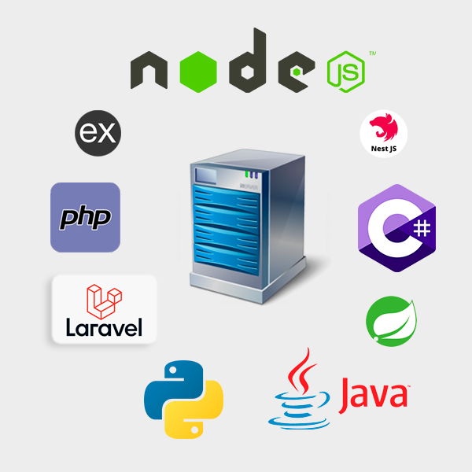

#### Back End

Lenguajes de programación como Node.js, PHP, C#, Python, Java, , que manejan la lógica del servidor. Frameworks como Express (Node.js), Django (Python), Spring (Java), y Laravel (PHP) facilitan el desarrollo estructurado.

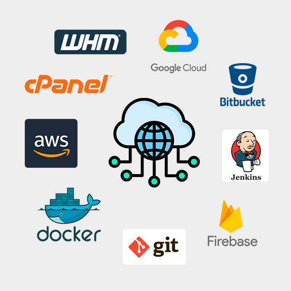

#### DevOps & Clouds

Se utilizan plataformas como AWS, y Google Cloud para proporcionar infraestructura, almacenamiento y servicios a escala global. Se utiliza herramientas como Jenkins, GitLab CI/CD y Bitbucket para automatizar la integración y entrega continua.

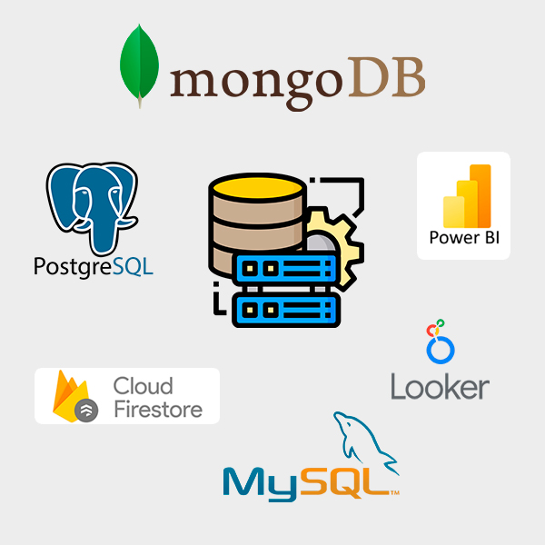

#### Base de Datos y Analítica

Pueden ser relacionales, como MySQL y PostgreSQL, que utilizan tablas y esquemas estructurados, o NoSQL, como MongoDB y Firestore, que ofrecen flexibilidad en el almacenamiento de datos no estructurados.

## Contáctanos

Contáctanos

### Ubicación:

Quito, Ecuador

### Email:

lesinnov@gmail.com

### Llámanos:

[+593 98 666 75 63](call:+593987705803)

### Whatsapp:

[Enviar Mensaje](https://wa.link/08ug55)
